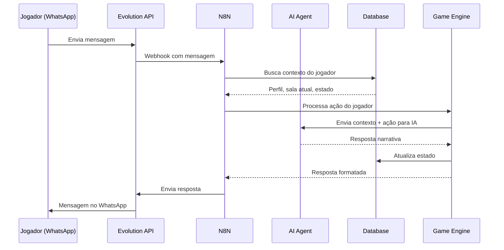

# 🏗️ Arquitetura Técnica — MUD-AI

<div align="center">
  [◀ Gameplay e Mecânicas](./02_GAMEPLAY_E_MECANICAS.md) | <strong>Arquitetura Técnica</strong> | [Monetização e Crescimento ▶](./04_MONETIZACAO_E_CRESCIMENTO.md)
</div>

> **Mesa de trabalho** — Rascunho de decisões técnicas e arquitetura.

---

## Visão Geral da Arquitetura

```
┌─────────────┐     ┌──────────────┐     ┌────────────────┐
│  JOGADORES  │────▶│   WHATSAPP   │────▶│   EVOLUTION    │
│ (WhatsApp)  │◀────│              │◀────│   API / Twilio │
└─────────────┘     └──────────────┘     └───────┬────────┘
                                                  │
                                                  ▼
┌─────────────┐     ┌──────────────┐     ┌────────────────┐
│  QR CODES   │────▶│   WEBHOOK    │────▶│     N8N        │
│(locais reais)│    │              │     │  (Orquestrador)│
└─────────────┘     └──────────────┘     └───────┬────────┘
                                                  │
                         ┌────────────────────────┼────────────────────────┐
                         ▼                        ▼                        ▼
                ┌────────────────┐     ┌──────────────────┐     ┌──────────────┐
                │  AI AGENT(s)   │     │   GAME ENGINE    │     │   DATABASE   │
                │  (LLM/GPT)    │     │  (Game State)    │     │  (Supabase/  │
                │                │     │                  │     │   Postgres)  │
                └────────────────┘     └──────────────────┘     └──────────────┘
```

---

## Stack Tecnológica Proposta

### Camada de Comunicação
| Componente | Tecnologia | Justificativa |
|------------|-----------|---------------|
| **Interface do jogador** | WhatsApp | Zero fricção, universal |
| **Gateway WhatsApp** | Evolution API ou Twilio | Evolution = open source, Twilio = robusto |
| **Webhooks** | N8N | Orquestra fluxos sem código, fácil de iterar |

### Camada de Inteligência
| Componente | Tecnologia | Função |
|------------|-----------|--------|
| **Game Master IA** | OpenAI GPT-4 / Claude | Gera narrativas, responde jogadores |
| **Reformulador de texto** | LLM (mesmo ou separado) | Modula tom emocional das mensagens |
| **Analisador de contexto** | LLM + embeddings | Cruza perfis, sugere conexões |
| **Moderador** | LLM + regras | Filtra conteúdo impróprio |

### Camada de Jogo
| Componente | Tecnologia | Função |
|------------|-----------|--------|
| **Estado do jogo** | N8N workflows + DB | Gerencia sessões, posições, inventários |
| **Motor de salas** | Lógica em N8N/código | Mundo de salas conectadas |
| **Sistema de QR** | URLs parametrizadas | Cada QR = webhook com ID do local |
| **Missões** | Definições em JSON/DB | Templates de missões com condições |

### Camada de Dados
| Componente | Tecnologia | Dados |
|------------|-----------|-------|
| **Database** | Supabase (PostgreSQL) | Jogadores, salas, estados, histórias |
| **Cache** | Redis (opcional, futuro) | Sessões ativas, contexto recente |
| **Vetorial** | pgvector / Pinecone | Embeddings de histórias para matching |

---

## Fluxo de uma Interação Típica



---

## Fluxo de QR Code

```
Jogador escaneia QR no bar
    ↓
QR = URL: mud-ai.app/qr/{local_id}?player={phone_hash}
    ↓
Webhook recebe no N8N
    ↓
N8N verifica:
  - Jogador existe? → Se não, onboarding
  - Local existe? → Carrega sala
  - Missão ativa? → Verifica condições
    ↓
IA gera mensagem contextualizada:
  "Você acaba de entrar no [Nome do Bar]...
   A energia aqui é [tema]. 
   Você encontra: [players presentes]
   Uma carta de consciência aparece: [carta]"
    ↓
Envia via WhatsApp
```

---

## Modelo de Dados (Versão Semente)

### Jogador
```json
{
  "id": "uuid",
  "phone_hash": "sha256...",
  "nome_personagem": "string",
  "sala_atual": "sala_id",
  "comunidades": ["lgbtqia_sp", "devs_sp"],
  "consciencias_desbloqueadas": ["acolhimento", "coragem"],
  "habilidades_ofereco": ["design", "python"],
  "habilidades_preciso": ["marketing"],
  "conexoes": ["player_id_1", "player_id_2"],
  "blocos_criados": 5,
  "locais_visitados": ["bar_1", "bar_3"],
  "badges": ["semente", "ponte"],
  "idiomas": ["pt-BR", "en"],
  "criado_em": "timestamp",
  "ultima_atividade": "timestamp"
}
```

### Sala/Local
```json
{
  "id": "uuid",
  "tipo": "bar|atelie|loja|parque|escola|coworking|evento|virtual",
  "comunidade_id": "lgbtqia_sp",
  "nome": "Bar XYZ",
  "descricao_base": "Um bar acolhedor na Consolação...",
  "descricao_ia": "gerada/evoluída pela IA",
  "endereco": "Rua X, 123",
  "qr_code_id": "string",
  "tema": "acolhimento",
  "exits": {
    "norte": "sala_id_2",
    "leste": "sala_id_3"
  },
  "jogadores_presentes": ["player_id_1"],
  "blocos_narrativos": ["bloco_id_1", "bloco_id_2"],
  "missoes_ativas": ["missao_id_1"]
}
```

### Bloco Narrativo (Contribuição do Jogador)
```json
{
  "id": "uuid",
  "autor_id": "player_id",
  "sala_id": "sala_id",
  "conteudo_original": "texto do jogador",
  "conteudo_curado": "texto processado pela IA",
  "tipo": "historia|sensacao|descricao|reflexao",
  "tags": ["cura", "coragem"],
  "likes": 12,
  "combinacoes": ["bloco_id_3"],
  "criado_em": "timestamp"
}
```

---

## Princípios de Implementação

### 🌱 "Semente que cresce"
1. **v0.1** — WhatsApp + IA conversacional básica (1 sala, sem QR)
2. **v0.2** — Múltiplas salas + movimentação + persistência
3. **v0.3** — QR Codes + primeiro bar parceiro
4. **v0.4** — Banco de trocas + matching por IA
5. **v0.5** — Construção emergente (blocos narrativos)
6. **v1.0** — MVP público com todos os pilares

### 🔑 Decisões-Chave Pendentes
- [ ] Evolution API vs Twilio vs outra solução WhatsApp?
- [ ] Qual LLM usar como backbone? (custo vs qualidade)
- [ ] Hospedar N8N onde? (self-hosted vs cloud)
- [ ] Como gerenciar custo de tokens de IA por jogador?
- [ ] Privacidade: como anonimizar dados sensíveis?
- [ ] Arquitetura multi-comunidade: mundos separados com portais, ou mundo único com "camadas"?
- [ ] Suporte multilíngue: IA traduz em tempo real ou comunidades por idioma?

---

<div align="center">
  [◀ Gameplay e Mecânicas](./02_GAMEPLAY_E_MECANICAS.md) | [🏠 Início](../README.md) | [Monetização e Crescimento ▶](./04_MONETIZACAO_E_CRESCIMENTO.md)
</div>

*Rascunho técnico — Evoluir conforme decisões são tomadas — Março/2026*
